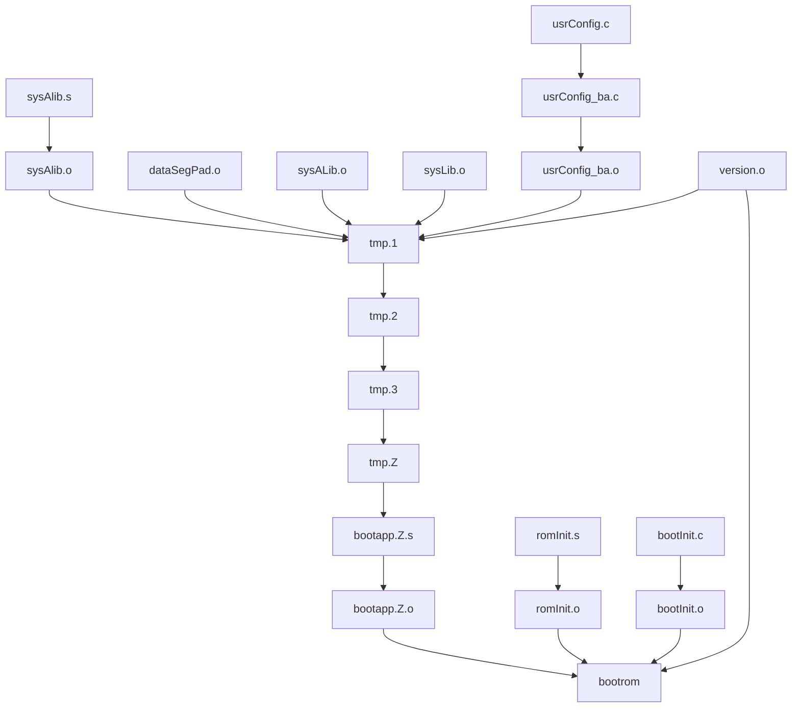

# VxWorks 6.6 for x86 的启动过程分析 

## BootLoader 

系统启动时，硬件首先上电加载 BIOS，BIOS 固定读取 512 字节的 MBR， MBR 以 0x55aa 结束：

```assembly
android@ubuntumysqlserver:~/share/qemu$ hexdump BOOTROM.IMG | grep aa55
00001f0 4d4f 5320 5359 2b00 5600 4558 5458 aa55
```

其中链接生成的 bootrom.bin 开头就是放的就是 romInit ：

```bash
ldpentium -X -N -e romInit -Ttext 00308000	 \
	-o bootrom romInit.o bootInit.o version.o  \
	bootapp.Z.o  \
     -T D:/vxworks/WindRiver/vxworks-6.6/target/h/tool/gnu/ldscripts/link.RAM
D:/vxworks/WindRiver/vxworks-6.6/host/x86-win32/bin/romsize pentium -b 00090000	 bootrom
bootrom: 12544(t) + 338512(d) = 351056 (238768 unused)
```

### romInit （romInit.s）

```assembly
	/* cold start entry point in REAL MODE(16 bits) */

romInit:
_romInit:
	cli				/* LOCK INTERRUPT */
	jmp	cold			/* offset must be less than 128 */


	/* warm start entry point in PROTECTED MODE(32 bits) */

	.balign 16,0x90
```

romInit 中的核心是 _romInit 主要完成的工作是：

1. 设置初始内存
2. 初始化处理器状态字
3. 创建一个临时栈

这些工作做完之后，就可以跳到 C 语言环境了， c 语言需要的栈和内存都已经准备好了。接下来 jump 到 C 代码  romStart

```assembly
romInit4:
	xorl	%ebp, %ebp		/* initialize the frame pointer */
	pushl	$0			/* initialise the EFLAGS */
	popfl
	pushl	%ebx			/* push the startType */
	movl	$ FUNC(romStart),%eax	/* jump to romStart */
	call	*%eax
```


### romStart （bootInit.c） 

romStart 已经是 c 语言环境，主要完成：

1. 清除内存 （决定于寄存器设置）
2. 拷贝 rom 代码到 ram （BIOS 只读取了 512 字节执行）
3. 如果 rom 是压缩过的，还需要解压 rom

由于系统启动一般只会拷贝很小一段 ROM 代码到内存执行，所以 ROM 代码中都会有自己拷贝自己的操作，来保证后续能够继续执行，ROM 代码可以设置成压缩模式，那么拷贝过程中，就会有解压的操作。这里就会有个矛盾，因为压缩过程需要时间，而压缩后 ROM 会变小，需要结合实际综合考虑。

- 压缩 ROM，占用空间小，启动时间长
- 非压缩 ROM，占用空间大，启动时间短

romStart 最后将代码执行权交给 ram 中的 absEntry，不同构架和不同配置， absEntry 会指向不同的地址：

```c
absEntry = (FUNCPTR)RAM_DST_ADRS;           /* sysInit() or usrEntry() */
absEntry = (FUNCPTR)usrInit;            /* on to bootConfig */
(absEntry) (startType);
```


## bootapp 

romStart 拷贝 ROM 完成后，就跳转到 ram 执行了，这时候 ram 中的结构如下：

按照链接脚本：

```bash
ldpentium -X -N -e romInit -Ttext 00308000	 \
	-o bootrom romInit.o bootInit.o version.o  \
	bootapp.Z.o  \
```

```
-o bootapp.Z.o bootapp.Z.s 
```

```
binToAsm tmp.Z > bootapp.Z.s
```

```
bin/deflate < tmp.3 >tmp.Z
```

```
objcopypentium -O binary --binary-without-bss tmp.2 tmp.3
```

```
ldpentium -o tmp.2 -X -N  -e sysInit \
      -Ttext 00108000	 tmp.1 ctdt.o -defsym _VX_DATA_ALIGN=1 \
      -T D:/vxworks/WindRiver/vxworks-6.6/target/h/tool/gnu/ldscripts/link.RAM
```

```
ccpentium -r -nostdlib -Wl,-X -o tmp.1 dataSegPad.o sysALib.o sysLib.o   usrConfig_ba.o \
	      version.o -Wl,--start-group \
```

整个的流程就是




```
Example memory layout for a 1-megabyte board:
\cs
    --------------  0x00100000 = LOCAL_MEM_SIZE = sysMemTop()
    |            |
    |    RAM     |
    |  0 filled  |
    |            |
    |------------| = (romInit+ROM_COPY_SIZE) or binArrayStart
    | ROM image  |
    |----------- |  0x00090000  = RAM_HIGH_ADRS
    | STACK_SAVE |
    |------------|
    |            |  0x00080000  = 0.5 Megabytes
    |            |
    |            |
    | 0 filled   |
    |            |
    |            |  0x00001000  = RAM_ADRS & RAM_LOW_ADRS
    |            |
    |            |  exc vectors, bp anchor, exc msg, bootline
    |            |
    |            |
    --------------  0x00000000  = LOCAL_MEM_LOCAL_ADRS
\ce
\cs
    --------------
    |    ROM     |
    |            |  0xff8xxxxx  = binArrayStart
    |            |
    |            |  0xff800008  = ROM_TEXT_ADRS
    --------------  0xff800000  = ROM_BASE_ADRS
\ce
```

最后进入系统启动核心： usrInit

## usrInit （usrConfig.c）

<!-- This is the first C code executed after the system boots. -->

